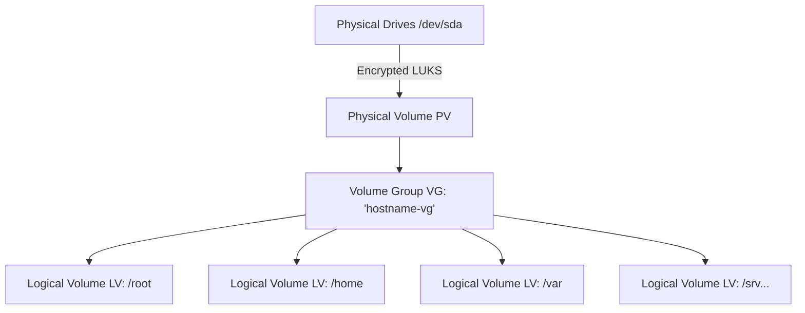
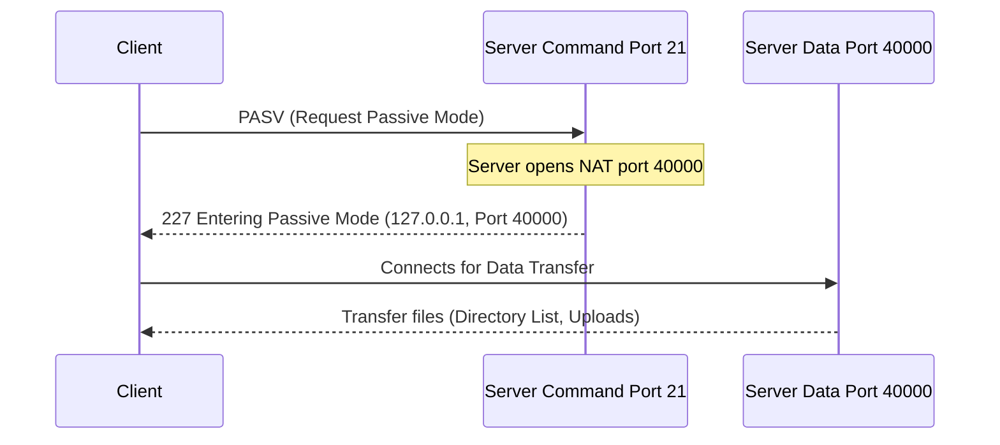

# 🪨 Rocky Linux Installation & Setup Guide (Bonus Included)

This step-by-step guide will walk you through setting up a headless Rocky Linux virtual machine that perfectly satisfies both the mandatory and bonus requirements of the Born2beroot project.

## 📑 Table of Contents
1. [💿 Phase 1: Virtual Machine Creation](#phase-1-virtual-machine-creation)
2. [🏗️ Phase 2: OS Installation & Encrypted LVM](#phase-2-os-installation--encrypted-lvm-bonus-layout)
3. [🛠️ Phase 3: Base Configuration & Sudo Setup](#phase-3-base-configuration--sudo-setup)
4. [🛡️ Phase 4: SSH, Firewalld & SELinux Configuration](#phase-4-ssh-firewalld--selinux-configuration)
5. [🔐 Phase 5: Password Policy & User Management](#phase-5-password-policy--user-management)
6. [⏱️ Phase 6: The Monitoring Script](#phase-6-the-monitoring-script)
7. [🌟 Phase 7: Bonus Services (WordPress & FTP)](#phase-7-bonus-services-wordpress--ftp)
8. [🎓 Appendix: The Ultimate Defense Cheat Sheet](#appendix-the-ultimate-defense-cheat-sheet)

---

## Phase 1: Virtual Machine Creation

### Prerequisite: Download the ISO
Ensure you have downloaded the **Rocky Linux Minimal ISO** directly from the official Rocky Linux website (e.g., `Rocky-9.x-x86_64-minimal.iso`).

### Setting up VirtualBox
1. Open **VirtualBox** and click **New**.
2. **Name:** Enter your machine name (e.g., `maaugust_born2beroot_rocky`).
3. **ISO Image:** Choose the `Rocky-minimal.iso` file you just downloaded.
4. ⚠️ **CRITICAL STEP:** You MUST check the box that says **Skip Unattended Installation**.
5. Click **Next**. Allocate at least **4096 MB** of RAM and 4 CPU.
6. Click **Next**. Create a **30 GB** dynamically allocated Virtual Hard Disk (required for the bonus layout). Click **Finish**.
7. Select your newly created VM and click **Settings**.
8. Go to **Network** and ensure Adapter 1 is set to **NAT**. Click **Advanced** and set up **Port Forwarding**:
   * **SSH:** Host Port `4242` -> Guest Port `4242`
   * **HTTP (Bonus):** Host Port `8080` -> Guest Port `80`
   * **FTP Command (Bonus):** Host Port `2121` -> Guest Port `21`
   * **FTP Data (Bonus):** Host Port `40000` -> Guest Port `40000`

> **[Insert Screenshot: VirtualBox Port Forwarding Rules showing all four port mappings]**

---

## Phase 2: OS Installation & Encrypted LVM (Bonus Layout)
Start your virtual machine and select **Install Rocky Linux**. Rocky uses the "Anaconda" installer. 

### Localization & User Setup
1. **Language:** Select your preferred language.
2. **Root Password:** Click this, set a strong password, and check "Lock root account". 
3. **User Creation:** Create your user (e.g., `maaugust`). Check **"Make this user administrator"**. Set your user password.

### Software Selection
1. Click **Software Selection**.
2. Ensure **"Minimal Install"** is selected on the left. Leave all right-side options unchecked to guarantee a headless environment.

> **[Insert Screenshot: Software Selection screen showing Minimal Install]**

### Partitioning Disks (The Most Critical Step)
To achieve the bonus score, you must set up 7 specific logical volumes.


1. Click **Installation Destination**.
2. Select your 30GB disk. Under Storage Configuration, select **Custom**, then click **Done** at the top left.
3. A new menu opens. Change the dropdown from "LVM" to **LVM Thin Provisioning** or standard **LVM** (Standard LVM is recommended for this project). Check the **Encrypt** box.
4. Click the blue link: **"Click here to create them automatically"**. Enter your Encryption Passphrase.
5. Anaconda will generate default partitions. **You must delete the `/home` and `/` (root) partitions to redistribute the space manually.**
6. Click the `+` button to create the required Bonus Logical Volumes:
   * **Mount Point:** `/` | **Capacity:** `10G`
   * **Mount Point:** `/home` | **Capacity:** `5G`
   * **Mount Point:** `/var` | **Capacity:** `3G`
   * **Mount Point:** `/tmp` | **Capacity:** `3G`
   * **Mount Point:** `/srv` | **Capacity:** `3G`
   * **Mount Point:** `/var/log` | **Capacity:** `4G`
   * *(Note: Keep the automatically generated `/boot` and `swap` partitions).*
7. Click **Done**, then click **Accept Changes**.

> **[Insert Screenshot: The Custom Partitioning screen showing all 7 required logical volumes mapped out]**

8. Click **Begin Installation**. Once finished, reboot the system.

---

## Phase 3: Base Configuration & Sudo Setup
Log in with your user account (`maaugust`) and your user password. Since you checked "Make this user administrator," you can use `sudo`.

### 🧠 Evaluation Prep: Defending Your Partition Sizes (`lsblk`)
Before installing packages, run the following command to view your new partition layout:
```bash
lsblk
```

**The Trap:** The evaluator will look at your output and ask: *"You said you made the root partition 10G, so why does `lsblk` say 9.3G?"*

**The Defense:** > "This happens because of the difference between Base-10 (Gigabytes) and Base-2 (Gibibytes). When I typed `10G` in the installer, it calculated it in standard decimal Gigabytes ($10 \times 1000^3$ bytes). However, the `lsblk` command displays output in binary Gibibytes ($1024^3$ bytes). If you do the math, $10,000,000,000 / 1024^3 \approx 9.31$ GiB. The sizes are mathematically exact!"

### 1. Update the System
Rocky Linux uses `dnf` instead of `apt`.
```bash
sudo dnf update -y
```

### 2. Group Management
In Rocky Linux, administrators are added to the `wheel` group by default, but the 42 subject specifically requires the `sudo` and `user42` groups.
```bash
# Create the required groups
sudo groupadd user42
sudo groupadd sudo

# Add your user to the groups
sudo usermod -aG sudo,user42 maaugust

# Verify the groups
groups maaugust
```

> **[Insert Screenshot: Output of the `groups maaugust` command showing user42 and sudo]**

### 3. Strict Sudo Configuration
```bash
sudo mkdir -p /var/log/sudo
sudo visudo
```

In Rocky, you must first tell `sudo` to recognize the `sudo` group. Find the line that allows people in group wheel to run all commands (`%wheel ALL=(ALL) ALL`), and add this directly below it:

```plaintext
%sudo   ALL=(ALL)       ALL
```

Next, add our strict subject requirements. Add these `Defaults` lines:
```plaintext
Defaults        secure_path="/usr/local/sbin:/usr/local/bin:/usr/sbin:/usr/bin:/sbin:/bin"
Defaults        passwd_tries=3
Defaults        badpass_message="Wrong password! This incident will be reported."
Defaults        requiretty
Defaults        logfile="/var/log/sudo/sudo.log"
```

Save and exit (`:wq` if using vi/vim).

> **[Insert Screenshot: The visudo file showing the new %sudo rule and the custom Defaults]**

### 4. Verify SELinux is Running
SELinux is the Mandatory Access Control system for Rocky Linux. It is enabled by default.
```bash
sestatus
```

> **[Insert Screenshot: Output of `sestatus` showing the current mode as "enforcing"]**

---

## Phase 4: SSH, Firewalld & SELinux Configuration

### 1. Configure Firewalld
Rocky uses `firewalld` instead of UFW.

```bash
# Check if it is running
sudo systemctl status firewalld

# Allow our custom SSH port and remove the default port 22
sudo firewall-cmd --permanent --add-port=4242/tcp
sudo firewall-cmd --permanent --remove-service=ssh
sudo firewall-cmd --reload

# Verify the rules
sudo firewall-cmd --list-all
```

> **[Insert Screenshot: Output of `firewall-cmd --list-all` showing port 4242/tcp is open]**

### 2. Configure SELinux for SSH (Critical Step)
If you change the SSH port without telling SELinux, it will aggressively block the SSH service from starting.
```bash
# Install the SELinux management tools
sudo dnf install policycoreutils-python-utils -y

# Tell SELinux that port 4242 is officially an SSH port
sudo semanage port -a -t ssh_port_t -p tcp 4242
```

### 3. Configure SSH
Now we can safely change the port in the configuration file.
```bash
sudo vi /etc/ssh/sshd_config
```

Find and modify (uncomment) these lines:
```plaintext
Port 4242
PermitRootLogin no
```

Save and exit, then restart the service:
```bash
sudo systemctl restart sshd
```

> **[Insert Screenshot: The modified sshd_config file]**

### 4. Test Your Connection
Open a terminal on your Host Machine:
```bash
ssh maaugust@localhost -p 4242
```

If you connect successfully, your Firewalld and SELinux port context configurations are perfect!

---

## Phase 5: Password Policy & User Management
The subject requires a highly strict password policy: passwords must expire every 30 days, have a minimum of 2 days between changes, send a 7-day warning, and require at least 10 characters with specific complexity (uppercase, lowercase, numeric, max 3 identical consecutive characters, no usernames, and 7 characters different from the previous password).

### 1. Configure Password Expiration (Aging)
First, we modify the default expiration rules for all *newly created* users.
Open the login definitions file:
```bash
sudo vi /etc/login.defs
```

Find and change the following values:
```plaintext
PASS_MAX_DAYS   30
PASS_MIN_DAYS   2
PASS_WARN_AGE   7
```

Save and exit.

Because `/etc/login.defs` only applies to users created after this change, we must manually apply these rules to the users we already created (`root` and `maaugust`):
```bash
# Apply to root
sudo chage -m 2 -M 30 -W 7 root

# Apply to your user
sudo chage -m 2 -M 30 -W 7 maaugust

# Verify the changes for your user
sudo chage -l maaugust
```

> **[Insert Screenshot: Output of `chage -l maaugust` showing the 30-day expiration policy]**

### 2. Configure Password Complexity
On Rocky Linux, we use the `libpwquality` library. It reads from a dedicated configuration file, making it much easier to manage than Debian's PAM files.
```bash
sudo dnf install libpwquality -y
```

Now, edit the password quality configuration file:
```bash
sudo vi /etc/security/pwquality.conf
```

Uncomment and modify the following lines to match the subject's strict rules exactly:
```plaintext
difok = 7
minlen = 10
dcredit = -1
ucredit = -1
lcredit = -1
maxrepeat = 3
usercheck = 1
enforce_for_root
```

**Explanation of flags for your defense:**
* `minlen=10`: Minimum 10 characters.
* `ucredit=-1`, `dcredit=-1`, `lcredit=-1`: Requires at least one uppercase, digit, and lowercase letter.
* `maxrepeat=3`: Denies more than 3 consecutive identical characters.
* `usercheck=1`: Prevents the password from containing the user's name.
* `difok=7`: Requires at least 7 characters that are different from the old password.
* `enforce_for_root`: Ensures the root user is also bound by these strict complexity rules.

---

## Phase 6: The Monitoring Script
The bash script to scrape system information relies entirely on standard Linux commands, so the script we wrote for Debian will work flawlessly on Rocky Linux without any changes!

### 1. Create the Script
Create the script in the `/usr/local/bin` directory:
```bash
sudo vi /usr/local/bin/monitoring.sh
```

Paste your optimized bash script (Press `i` to enter insert mode):
```bash
#!/bin/bash

arc=$(uname -a)
pcpu=$(grep "physical id" /proc/cpuinfo | sort -u | wc -l)
vcpu=$(grep "^processor" /proc/cpuinfo | wc -l)
ram=$(free -m | awk '$1 == "Mem:" {printf "%d/%dMB (%.2f%%)", $3, $2, $3/$2*100}')
disk=$(df -m | grep "^/dev/" | grep -v "/boot$" | awk '{ut += $3; tt += $2} END {printf "%d/%dGb (%d%%)", ut, tt/1024, ut/tt*100}')
cpul=$(LC_ALL=C top -bn1 | grep '^%Cpu' | tr ',' ' ' | awk '{printf "%.1f%%", 100 - $8}')
lb=$(who -b | awk '$1 == "system" {print $3 " " $4}')
lvmu=$(if [ $(lsblk | grep "lvm" | wc -l) -gt 0 ]; then echo yes; else echo no; fi)
tcpc=$(ss -ta | grep ESTAB | wc -l)
ulog=$(users | wc -w)
ip=$(hostname -I | awk '{print $1}')
mac=$(ip link | grep "link/ether" | awk '{print $2}')
cmds=$(journalctl _COMM=sudo | grep COMMAND | wc -l)

wall "#Architecture: $arc
#Physical CPU: $pcpu
#vCPU: $vcpu
#Memory Usage: $ram
#Disk Usage: $disk
#CPU load: $cpul
#Last boot: $lb
#LVM use: $lvmu
#TCP Connections: $tcpc ESTABLISHED
#User log: $ulog
#Network: IP $ip ($mac)
#Sudo: $cmds cmd"
```

Save and exit (Press `Esc`, then `:wq`). Now, make the script executable:
```bash
sudo chmod +x /usr/local/bin/monitoring.sh
```

### 2. Schedule the Script with Cron
We will use `cron` to execute this script at server startup AND every 10 minutes. To ensure it perfectly aligns with your server's exact boot time, we will use a dynamic sleep offset.

Rocky minimal might require installing the cron daemon manually:
```bash
sudo dnf install cronie -y
sudo systemctl enable --now crond
```

Now, open the root crontab:
```bash
sudo crontab -e
```

Add the following TWO lines:
```plaintext
@reboot /usr/local/bin/monitoring.sh
*/10 * * * * sleep $(who -b | awk '{split($4, time, ":"); print time[2]\%10}')m && /usr/local/bin/monitoring.sh
```

Save and exit.

**🧠 Explanation for your defense:**
* **The `@reboot` line:** Guarantees the script broadcasts immediately when the server boots.
* **The `*/10` line:** We calculate the exact minute your server booted. If it booted at `17:48`, `48 % 10 = 8`. Cron triggers every 10 minutes on the clock (e.g. `18:00`), but the `sleep 8m` forces it to wait exactly 8 minutes, firing perfectly at `18:08` to match your uptime!

### 3. Verify the Script
To ensure it works without waiting 10 minutes, run it manually:
```bash
/usr/local/bin/monitoring.sh
```

You should see the wall broadcast pop up on your terminal instantly.

> **[Insert Screenshot: The output of the monitoring script perfectly matching the subject's example format]**

---

## Phase 7: Bonus Services (WordPress & FTP)
To achieve the bonus, we must set up a functional WordPress website using Lighttpd, MariaDB, and PHP (a LEMP stack) . We also need to configure an FTP service (vsftpd) and a security service (Fail2ban) to protect them.

### 🧠 Evaluation Prep: Defending Your Bonus Choices
During the defense, the evaluator will ask you to explain exactly what these services do and **why you chose them** (especially your "free-choice" service). Here is how you answer:

* **Lighttpd (Web Server):** The subject strictly forbids using the industry standards, Apache2 and NGINX. Lighttpd is the optimal alternative because it is exceptionally fast, uses a tiny memory footprint, and seamlessly handles PHP via FastCGI.
* **MariaDB (Database):** A fully open-source, highly secure, drop-in replacement for MySQL. It is required to store all of WordPress's dynamic data, user accounts, and settings.
* **PHP:** A server-side scripting language. Since the core of WordPress is written in PHP, this processor is mandatory to dynamically generate the HTML web pages and communicate with the MariaDB database.
* **vsftpd (File Transfer):** Stands for "Very Secure FTP Daemon". I chose this because of its incredibly strict security defaults. It allows us to easily "jail" (chroot) our FTP user, guaranteeing they can only upload files to the `/srv/wordpress` directory.
* **Fail2ban (The "Free-Choice" Service):** An active intrusion prevention framework . I chose this as my extra service because it perfectly aligns with the project's core theme of extreme server security. By opening new ports (80 and 21), we increased our attack surface. Fail2ban monitors our service logs in real-time and automatically bans the IP addresses of attackers trying to brute-force our SSH or FTP passwords.

### 1. Update the Firewall
Our new services need specific ports open to communicate with the outside world, including our custom FTP Passive mode data port (40000).
```bash
# Allow HTTP (Web Server) and FTP
sudo firewall-cmd --permanent --add-port=80/tcp
sudo firewall-cmd --permanent --add-port=21/tcp
sudo firewall-cmd --permanent --add-port=40000/tcp
sudo firewall-cmd --reload

# Verify the new rules
sudo firewall-cmd --list-all
```

### 2. Install the LEMP Stack (Lighttpd, MariaDB, PHP)
On Rocky Linux, Lighttpd and Fail2ban are housed in the EPEL (Extra Packages for Enterprise Linux) repository. We must install that first:
```bash
sudo dnf install epel-release -y
sudo dnf update -y
```

Now, install the core packages:
```bash
sudo dnf install lighttpd lighttpd-fastcgi mariadb-server php php-fpm php-mysqlnd wget -y
```

**⚠️ Link Lighttpd to PHP:**

Rocky does not auto-configure PHP for Lighttpd. We must do it manually.
```bash
sudo vi /etc/lighttpd/modules.conf
```

Find the line `#include "conf.d/fastcgi.conf"` and **uncomment it** (remove the `#`). Save and exit.

Next, configure the FastCGI module to use PHP-FPM:
```bash
sudo vi /etc/lighttpd/conf.d/fastcgi.conf
```

Add the following block at the bottom of the file to map PHP requests to the PHP-FPM processor:
```plaintext
fastcgi.server += ( ".php" =>
        ((
                "host" => "127.0.0.1",
                "port" => "9000",
                "broken-scriptfilename" => "enable"
        ))
)
```

Save and exit. Now, enable and start all the services:
```bash
sudo systemctl enable --now lighttpd mariadb php-fpm
```

### 3. Configure the MariaDB Database
Secure the database installation:
```bash
sudo mariadb-secure-installation
```

*(Press `Enter` for current password, then answer `Y` to set a root password and `Y` to all subsequent security questions).*

Next, log into the MySQL console to create the WordPress database and user:
```bash
mariadb -u root -p
```

Run the following SQL commands exactly as written:
```sql
CREATE DATABASE wordpress;
CREATE USER 'maaugust'@'localhost' IDENTIFIED BY '12345';
GRANT ALL PRIVILEGES ON wordpress.* TO 'maaugust'@'localhost';
FLUSH PRIVILEGES;
EXIT;
```

> **[Insert Screenshot: The MariaDB console showing the successful creation of the database and user]**

### 4. Install WordPress & Configure SELinux (CRITICAL)
Download WordPress and place it inside the `/srv` partition we created during Phase 2.
```bash
wget https://wordpress.org/latest.tar.gz
sudo tar -xzvf latest.tar.gz -C /srv/
rm latest.tar.gz
```

Change Lighttpd's document root to point to our bonus partition:
```bash
sudo vi /etc/lighttpd/lighttpd.conf
```

Find `server.document-root = "/var/www/lighttpd"` and change it to:
```plaintext
server.document-root        = "/srv/wordpress"
```

Save and exit, then restart the web server:
```bash
sudo systemctl restart lighttpd
```

**⚠️ The SELinux Web Configuration:**

If you try to load the website right now, SELinux will block it. We must explicitly tell SELinux that the web server is allowed to read the `/srv/wordpress` directory AND connect to the MariaDB database.
```bash
# Allow the web server to connect to the database
sudo setsebool -P httpd_can_network_connect_db 1

# Change the SELinux security context of the WordPress folder so Lighttpd can read/write to it
sudo semanage fcontext -a -t httpd_sys_rw_content_t "/srv/wordpress(/.*)?"
sudo restorecon -Rv /srv/wordpress

# Give the web server standard ownership of the files
sudo chown -R lighttpd:lighttpd /srv/wordpress
```

Finally, configure the WordPress connection:
```bash
sudo cp /srv/wordpress/wp-config-sample.php /srv/wordpress/wp-config.php
sudo vi /srv/wordpress/wp-config.php
```

Update these three specific lines with your database info:
```php
define( 'DB_NAME', 'wordpress' );
define( 'DB_USER', 'maaugust' );
define( 'DB_PASSWORD', '12345' );
```

Save and exit. Test it on your Host Machine browser at `http://localhost:8080`!

> **[Insert Screenshot: The WordPress welcome screen in your browser]**

### 5. Set up the FTP Server (vsftpd)
```bash
sudo dnf install vsftpd -y
```

Configure the FTP daemon:
```bash
sudo vi /etc/vsftpd/vsftpd.conf
```

Find and modify (or add) these specific lines to lock the FTP user in securely and force Passive Mode for the NAT connection:


```plaintext
listen=YES
listen_ipv6=NO
anonymous_enable=NO
local_enable=YES
write_enable=YES
chroot_local_user=YES
allow_writeable_chroot=YES
userlist_enable=YES
userlist_file=/etc/vsftpd/user_list
userlist_deny=NO

# VirtualBox NAT Passive Mode Fix
pasv_enable=YES
pasv_min_port=40000
pasv_max_port=40000
pasv_address=127.0.0.1
```

Save and exit.

**⚠️ The SELinux FTP Configuration:**

SELinux will block FTP users from reading or writing files outside of their standard home directories by default. We must allow it.
```bash
sudo setsebool -P ftpd_full_access 1
```

Create the FTP user and assign ownership:
```bash
# Create the user (it will prompt you to set a password)
sudo adduser ftpuser
sudo passwd ftpuser

# Add the user to the allowed FTP list
echo "ftpuser" | sudo tee -a /etc/vsftpd/user_list

# Set the user's home directory to our WordPress folder
sudo usermod -d /srv/wordpress ftpuser

# Restart and enable the service
sudo systemctl enable --now vsftpd
```

> **[Insert Screenshot: Using FileZilla to successfully log into the VM as 'ftpuser' on port 21]**

### 6. Set up Fail2ban (Extra Security Bonus)
```bash
sudo dnf install fail2ban -y
```

Copy the jail configuration and edit it:
```bash
sudo cp /etc/fail2ban/jail.conf /etc/fail2ban/jail.local
sudo vi /etc/fail2ban/jail.local
```

*(This file is massive! Press `/` in `vi` to search for the specific headers).*

**1. Enable the SSH Jail:**
Press `/`, type `\[sshd\]`, and press Enter. Add `enabled = true` under it and fix the port:
```plaintext
[sshd]
enabled = true
port    = 4242
```

**2. Enable the FTP Jail:**
Press `/`, type `\[vsftpd\]`, and press Enter. Add `enabled = true`:
```plaintext
[vsftpd]
enabled = true
```

Save and exit (`:wq`). Restart the service:
```bash
sudo systemctl enable --now fail2ban
sudo fail2ban-client status
```

> **[Insert Screenshot: Output of `fail2ban-client status` showing the active jails]**

---

## Appendix: The Ultimate Defense Cheat Sheet
During your evaluation, you will be asked to perform live administrative tasks to prove you understand the system. Here are the exact Rocky Linux commands you need to know by heart:

### 1. System Identity & Version Verification
The evaluator will ask you to prove you are running Rocky Linux and not a GUI.
* **Check OS Version:** `cat /etc/os-release` or `hostnamectl`
* **Check SELinux Status:** `sestatus`

### 2. Changing the Hostname (Live Test)
Evaluators almost always ask you to change your server's hostname.
1. **Change the hostname:**
   ```bash
   sudo hostnamectl set-hostname new_hostname
   ```
2. **Update the hosts file (CRITICAL):**
   ```bash
   sudo vi /etc/hosts
   ```
   *Find your old hostname and replace it with the new one.*
   ```bash
   127.0.0.1   localhost
   127.0.1.1   evaluator_name42   # <--- Change this line to your new hostname!
  
   ::1         localhost ip6-localhost ip6-loopback
   ff02::1     ip6-allnodes
   ff02::2     ip6-allrouters
   ```
   
3. **Reboot:**
   ```bash
   sudo reboot
   ```

### 3. User and Group Management
* **Create a new user:** `sudo adduser new_username`
* **Set the user's password:** `sudo passwd new_username`
* **Create a new group:** `sudo groupadd evaluating`
* **Add user to group:** `sudo usermod -aG evaluating new_username`
* **Verify user's groups:** `groups new_username`
* **Check password expiration:** `sudo chage -l new_username`

### 4. Sudo Logging & Verification
* **View the sudo log:** `sudo cat /var/log/sudo/sudo.log`
* **View sudo actions in the journal:** `journalctl _COMM=sudo`

### 5. Firewalld Management
The evaluator will ask you to add a port (e.g., `8080`), verify it, and delete it.
* **Check active rules:**
  ```bash
  sudo firewall-cmd --list-all
  ```
* **Open a new port temporarily for testing:**
  ```bash
  sudo firewall-cmd --add-port=8080/tcp
  ```
* **Remove the rule:**
  ```bash
  sudo firewall-cmd --remove-port=8080/tcp
  ```

### 6. The Monitoring Script Modification
The evaluator will ask you to make the script run every minute instead of every 10 minutes.
* **Edit the crontab:** `sudo crontab -e`
* **Change the timer:** Change `*/10 * * * *` to `* * * * *` (and remove the `sleep` command).
* **Save and wait 60 seconds** to prove the broadcast triggers!

### 7. Live Testing the Bonus Services
If you did the bonus, follow this script to demonstrate the services perfectly:

#### Test A: Lighttpd, PHP, and MariaDB
1. On your **Host Machine** (your physical computer), open a web browser.
2. Navigate to `http://localhost:8080`.
3. Show the evaluator the functioning WordPress site and create a test post.

#### Test B: vsftpd (File Transfer)
1. On your **Host Machine**, open an FTP client (like FileZilla) or use the terminal: `ftp localhost 2121`.
2. Log in with the `ftpuser` credentials. 
3. Upload a random text file (e.g., `test_upload.txt`).
4. On your **Virtual Machine**, navigate to `/srv/wordpress` and type `ls -l` to prove the file successfully arrived!

#### Test C: Fail2ban (The Security Service)
1. On your **Host Machine**, open a terminal and try to SSH into your server: `ssh maaugust@localhost -p 4242`.
2. Intentionally type the **WRONG password** 3 to 5 times.
3. On your **Virtual Machine**, check the Fail2ban status:
   ```bash
   sudo fail2ban-client status sshd
   ```
4. You will see your Host Machine's gateway IP listed under **Banned IP list**!
5. **To unban yourself:**
   ```bash
   sudo fail2ban-client set sshd unbanip <banned_ip_address>
   ```

---

**🎉 Congratulations!**

If you have followed this guide, you have successfully conquered the notorious SELinux and built a completely fortified, enterprise-grade Rocky Linux server. You are fully prepared to pass the Born2beroot evaluation with a **125% Bonus score**!
